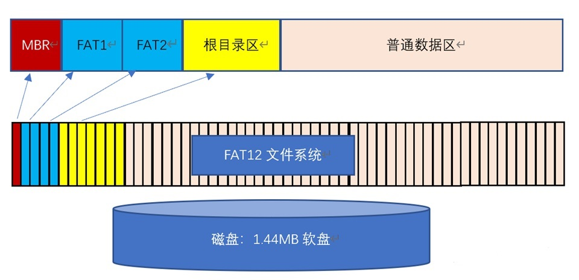
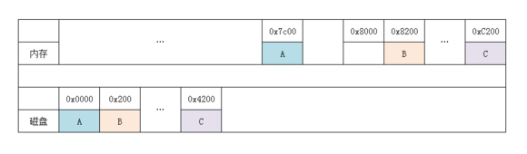
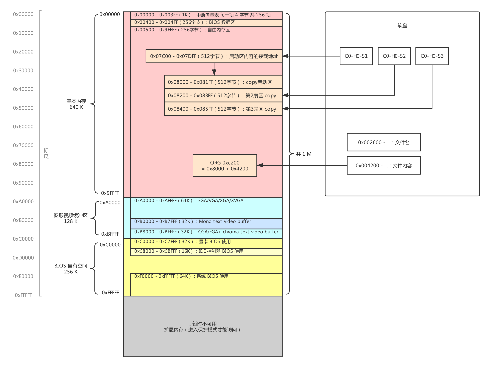

# 环境准备

## JAVA

​	自定义的镜像生成工具需要

## MinGW

​	可以在windows上使用gcc进行编译

# FAT12格式

MBR:1个扇区

FAT1:9个扇区

FAT2:9个扇区

根目录区:14个扇区(一共224个文件，每个文件32位)

数据区:0x4200-0x16800

# 内存分布地图

**noob-os中的内存分布**

**`0x00000000 - 0x000fffff` : 虽然在启动中会多次使用，但之后就变空。（`1MB`）**

**`0x00100000 - 0x00267fff` : 用于保存软盘的内容。（`1440KB`）**

**`0x00268000 - 0x0026f7ff` : 空（`30KB`）**

**`0x0026f800 - 0x0026ffff` : `IDT` （`2KB`）**

**`0x00270000 - 0x0027ffff` : `GDT` （`64KB`）**

**`0x00280000 - 0x002fffff` : `bootpack.hrb`（`512KB`）**

**`0x00300000 - 0x003fffff` : 栈及其他（`1MB`）**

**`0x00400000` - : 空**

# 工具

位于tools目录

## nasm.exe

汇编的编译工具

## make.exe

根据Makefile中定义的规则进行编译

## FAT12tool

java写的组装镜像工具类

# 编译过程

# 文件格式

## asm

汇编源文件

## lst

编译的中间产品.lst文件可用于排错 

## bin

二进制文件

## obj

​	目标文件是一种特殊的机器语言文件，必须与其他文件链接（link）后才能变成真正可以执行的机器语言。链接是什么意思呢？实际上C语言的作者已经认识到，C语言有它的局限性，不可能只用C语言来编写所有的程序，所以其中有一部分必须用汇编来写，然后链接到C语言写的程序上。

# 注意

## makefile

* 命令行必须前必须是TAB，不能是空格，有些文本编辑器自动会将TAB替换成空格

## 书中网址更新

http://community.osdev.info/?(AT)memorymap → http://oswiki.osask.jp/?(AT)memorymap

http://community.osdev.info/?(AT)BIOS → http://oswiki.osask.jp/?(AT)BIOS